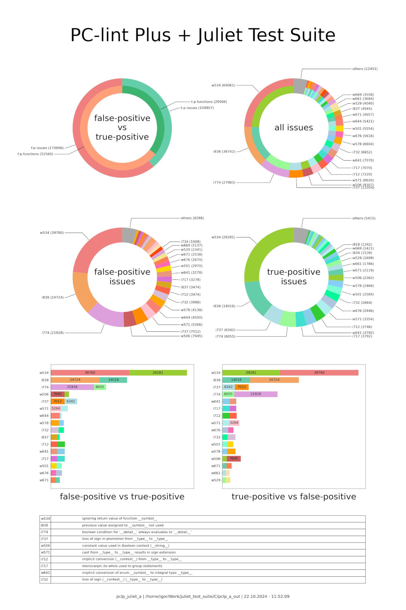

# pclp_juliet_a

Benchmark PC-lint Plus using Juliet as a reference Dataset.



## Starring Roles

**PC-lint Plus** - Static Code Analysis Tool for C and C++ Source Code.  

> PC-lint Plus is a static analysis tool that finds bugs, quirks, idiosyncrasies, and glitches in C and C++ programs. The purpose of this analysis is to determine potential problems in such programs before integration or porting, or to reveal unusual constructs that may be a source of subtle and, yet, undetected errors.  

**Juliet** - C/C++ Software Assurance Reference Dataset.

> The test suite was created by the National Security Agency’s (NSA) Center for Assured Software (CAS) and developed specifically for assessing the capabilities of static analysis tools.  

> Test cases are pieces of buildable code that target exactly one type of flaw and typically contain one or more non-flawed constructs that perform a function similar to the flawed construct. Test cases must define bad and good functions.

The *bad* functions contains the flawed construct.  The name of the functions are followed by the string *“_bad”*, such as *“CWE78_OS_Command_Injection_bad()”*.

The *good* functions does not contain the flawed constructs. The name of the functions are followed by the string *“_good”*, such as *“CWE78_OS_Command_Injection_good()”*.

**pclp_juliet_a** - Bash and Python scripts automatically run benchmarks against PC-lint Plus using Juliet as a reference dataset.

## In a nutshell

**pclp_juliet_a** searches all Makefiles in the Juliet dataset. For each Makefile, it invokes the PC-lint Plus static analyzer. It interprets the result generated by PC-lint Plus. For each problem found by PC-lint Plus, pclp_juliet_a analyzes the corresponding C file and checks whether the problem was found in a *"bad"* function (true positive case) or a *"good"* function (false positive case). Finally, an infographic with the benchmark results is generated:

- *false-positive vs true-positive* - a pie chart showing the general proportions of the issues found:
    - per issues - the total count of issues in *"good"* vs *"bad"* functions.
    - per functions - the total count of *"good"* vs *"bad"* functions with issues.
- *all issues* - a pie chart showing the most common issues (in both the *"good"* and *"bad"* functions).
- *false-positive issues* - a pie chart showing the most common issues in *"good"* functions.
- *true-positive issues* - a pie chart showing the most common issues in *"bad"* functions.
- *false-positive vs true-positive* - a bar diagram showing the most common issues found in *"good"* functions comparing to *"bad"* functions.
- *true-positive vs false-positive* - a bar diagram showing the most common issues found in *"bad"* functions comparing to *"good"* functions.
- table containing the text description for the most common issues.

## True-Positive vs False-Positive

- *false positive* - the error in binary classification in which a test result incorrectly indicates the presence of a condition (such as a disease when the disease is not present). 
- *false negative* - the opposite error, where the test result incorrectly indicates the absence of a condition when it is actually present. 
- *true positive* - the correct result, where the test result correctly indicates the presence of a condition.
- *true negative* - the correct result, where the test result correctly indicates the absence of a condition.

pclp_juliet_a recognizes the following issues:

- **true positive** - when a issue is correctly found in bad-function code.
- **false positive** - when a issue is incorrectly found in good-function code

## Prerequisites

### Install PC-lint Plus

Download *pclp.linux.2.2.tar.gz* from https://pclintplus.com/downloads/

Create *pclint* directory: `mkdir ~/pclint`

Move to *pclint* directory: `cd ~/pclint`

Copy downloaded *pclp.linux.2.2.tar.gz* to `~/pclint`

Extract *pclp.linux.2.2.tar.gz*: `tar -xvzf pclp.linux.2.2.tar.gz`

Copy the license file (* .lic) to: `~/pclint/pclp/`

Add *pclint* to the PATH environment variable, modify: `~/.profile`, append the following line to the end:

```bash
PATH="$PATH:$HOME/pclint/pclp"
```

Log out, log in, check if the pclint is found: `which pclp64_linux`

### Install PC-lint Plus required Python modules

Assumption that Python is already installed. Install PIP (if not already installed):

```bash
sudo apt update
sudo apt install python3-pip
```

Check if successfully installed: `pip3 --version`

Install the PC-lint Plus required Python modules *regex* and *pyyaml*, and *matplotlib* required by pclp_juliet_a:

```bash
pip3 install regex
pip3 install pyyaml
pip3 install matplotlib
```

In case the above gives PEP 668 error message:

```bash
$ pip3 install regex
error: externally-managed-environment

× This environment is externally managed
╰─> To install Python packages system-wide, try apt install
    python3-xyz, where xyz is the package you are trying to
    install.
```

install the required Python modules using 'apt install python3-...':

```bash
sudo apt install python3-regex
sudo apt install python3-yaml
sudo apt install python3-matplotlib
```

### Build imposter with gcc

According to PC-lint Plus documentation:
> To obtain the compiler invocations, we need to employ a separate tool, the imposter. The imposter program, provided as imposter.c in the config/ directory of the PC-lint Plus distribution, is a stand-in for the compiler that logs the options it is called with to a file in a format that can be used by pclp_config to generate a project configuration.

```bash
cd ~/pclint/pclp/config
gcc imposter.c -o imposter
```

## Prepare pclp_juliet_a

### Clone pclp_juliet_a repository

```bash
git clone "https://github.com/igor-marinescu/pclp_juliet_a.git"
cd pclp_juliet_a
```

Set execution permissions for *pclp_juliet_a.sh* script:

```bash
chmod u=rwx,g=r,o=r pclp_juliet_a.sh
```

### Copy Juliet Test Suite

Create a directory for the Juliet Test Suite.  
Download Juliet Test Suite from https://samate.nist.gov/SARD/test-suites/112  
Copy the downloaded test suite and unzip it:

```bash
mkdir juliet_test_suite
cp 2017-10-01-juliet-test-suite-for-c-cplusplus-v1-3.zip juliet_test_suite/
unzip juliet_test_suite/2017-10-01-juliet-test-suite-for-c-cplusplus-v1-3.zip
```

## Execute pclp_juliet_a.sh Bash script

The script accepts the following arguments:

`./pclp_juliet_a.sh <working_directory> <ignore_modules>`

*working_directory* - directory containing all files and subdirectories to be analyzed. To analyze the Juliet Test Suite, specify the root directory of the C-code `juliet_test_suite/C/`.

*ignore_modules* - a text file where each line is a module (file name or path) to ignore during analysis. The file name and path can be specified absolutely or relative to the working directory. The empty lines and lines starting with # are ignored.

Example of invoking the script:

```bash
 ./pclp_juliet_a.sh juliet_test_suite/C/ ignore_modules.txt
```

The script loads the file *args.lnt* which contains additional PC-lint Plus arguments. *args.lnt* is a text file where each line is an argument for PC-lint Plus, example:

```
-e537
-e451
```

The script searches all Makefiles in the *working_directory* (and all subdirectories) and invokes PC-lint Plus for each Makefile found:

```bash
$ ./pclp_juliet_a.sh juliet_test_suite/C/ ignore_modules.txt 
[INFO] PCLint extra options: /home/igor/Work/pclp_juliet_a/args.lnt
[INFO] Ignored modules file: /home/igor/Work/pclp_juliet_a/ignore_modules.txt
[INFO] WORKING_DIR=/home/igor/Work/juliet_test_suite/C
[INFO] Results=pclp_a_out
[INFO] GCC_EXE=/usr/bin/gcc
[INFO] PCLP_PATH=/home/igor/pclint/pclp
[INFO] Generate compiler configuration
[  1/153] /home/igor/Work/juliet_test_suite/C/testcases/CWE400_Resource_Exhaustion/s02/Makefile
[  2/153] /home/igor/Work/juliet_test_suite/C/testcases/CWE400_Resource_Exhaustion/s01/Makefile
[  3/153] /home/igor/Work/juliet_test_suite/C/testcases/CWE773_Missing_Reference_.../Makefile
...
```

For each Makefile found, a similar directory is created in `<working_directory>/pclp_a_out` folder. The results generated by PC-lint Plus are stored in the file *ig_pclint_out.txt*.

```bash
$ find juliet_test_suite/C/ -name "ig_pclint_out.txt"
/home/igor/Work/juliet_test_suite/C/pclp_a_out/testcases/CWE400_Resource_Exhaustion/s02/ig_pclint_out.txt
/home/igor/Work/juliet_test_suite/C/pclp_a_out/testcases/CWE400_Resource_Exhaustion/s01/ig_pclint_out.txt
/home/igor/Work/juliet_test_suite/C/pclp_a_out/testcases/CWE773_Missing_Reference_.../ig_pclint_out.txt
```

After PC-lint Plus has analyzed all the Makefiles found (ignoring those in the ignore list), the *pclp_a_main.py* script is automatically invoked. *pclp_a_main.py* interprets the result generated by PC-lint Plus. For each issue found, the script analyzes the corresponding C file to check whether the issue was found in a *"bad"* function (true positive case) or a *"good"* function (false positive case).

```bash
...
gres_path: /home/igor/Work/juliet_test_suite/C/pclp_a_out
Module ignore list:
/home/igor/Work/juliet_test_suite/C/testcasesupport/io.c
/home/igor/Work/juliet_test_suite/C/testcasesupport/std_thread.c
/home/igor/Work/juliet_test_suite/C/Makefile
make_path: /home/igor/Work/juliet_test_suite/C/testcases/CWE400_Resource_Exhaustion/s02
lres_path: /home/igor/Work/juliet_test_suite/C/pclp_a_out/testcases/CWE400_Resource_Exhaustion/s02
make_path: /home/igor/Work/juliet_test_suite/C/testcases/CWE400_Resource_Exhaustion/s01
lres_path: /home/igor/Work/juliet_test_suite/C/pclp_a_out/testcases/CWE400_Resource_Exhaustion/s01
make_path: /home/igor/Work/juliet_test_suite/C/testcases/CWE773_Missing_Reference_...
lres_path: /home/igor/Work/juliet_test_suite/C/pclp_a_out/testcases/CWE773_Missing_Reference_...
```

*pclp_a_main.py* counts all the *true-positive* and *false-positive* cases and generates the infographic with the results:

```bash
Generating infograph...
Infograph generated:  /home/igor/Work/juliet_test_suite/C/pclp_a_out/infograph_out.jpg
```

## Execute Python scripts standalone

```bash
python3 scripts/pclp_a_main.py juliet_test_suite/C/ ignore_modules.txt
```

```bash
python3 -m scripts/c_parser_src <path_to_analyze>
```

```bash
python3 -m scripts/pclp_out_interpret_src <pclp_out_file>
```

## Execute pylint

```bash
pclp_juliet_a>pylint scripts
```

## TODO:

